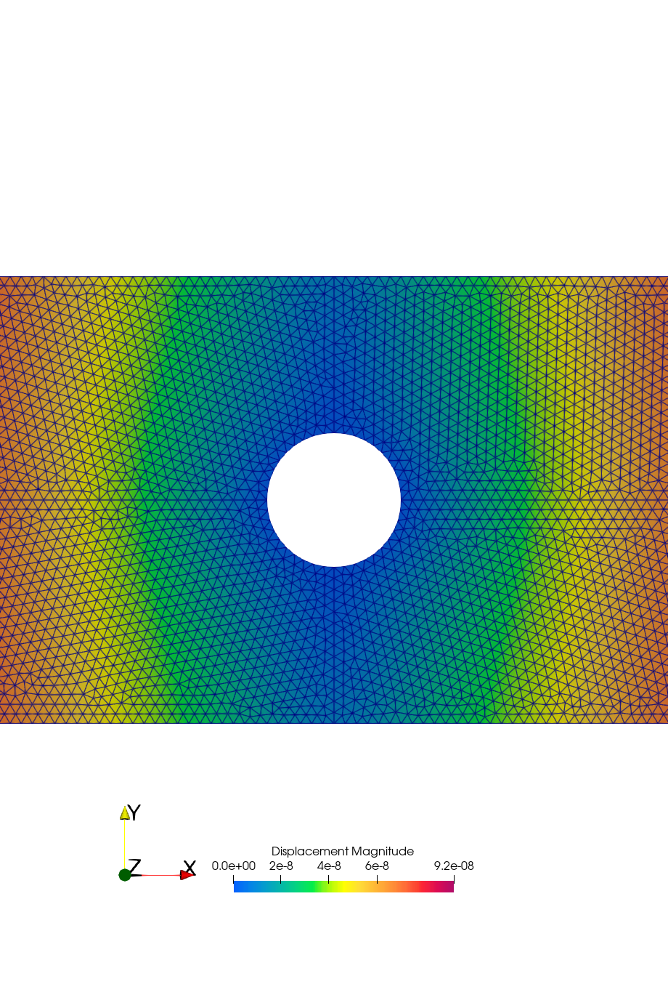
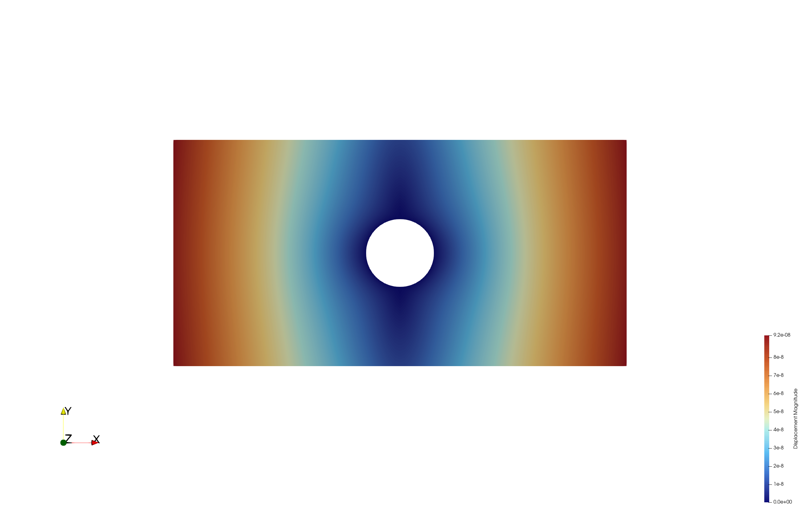

# Python-Based FEM Pre-processing and Post-processing GUI

A modular Python graphical user interface developed during an internship at Swansea University to support finite element model preparation and result post-processing.

The application brings together geometry definition, material assignment, Gmsh-based mesh generation, boundary conditions, loads, automated solver-input generation, and VTU result reading in a single workflow.

> **Solver note:** The finite element solver used for numerical analysis was an existing Fortran solver provided separately. It is **not included** in this repository. This project focuses on the Python GUI, FEM pre-processing workflow, automated input-file generation, solver interface, and VTU post-processing.

## Project workflow

```text
Geometry
   ↓
Material Definition
   ↓
Gmsh Mesh Generation
   ↓
Boundary Conditions & Loads
   ↓
Automatic input.txt Generation
   ↓
Existing Fortran FEM Solver
   ↓
VTU Results
   ↓
PyVista / ParaView Post-processing
```

## Main features

- 2D geometry definition with rectangular domains, internal interfaces, and circular holes
- Geometry validation before mesh generation
- Material-region generation and material-property definition
- Young's modulus, Poisson's ratio, and density inputs
- Automatic triangular mesh generation using the Gmsh Python API
- Boundary-node and boundary-edge classification
- Support and load definition through the GUI
- Automatic generation of solver-compatible `input.txt` files
- VTU result import using PyVista
- FEM result inspection and visualisation using the generated result data and ParaView
- Modular software architecture with a shared `FEMModel`

## Software architecture

The GUI is organised into functional modules that communicate through a central FEM model.

```text
PyQt6 GUI
    │
    ▼
Functional Modules
    │
    ▼
FEMModel
    │
    ├── Geometry & Meshing
    │
    ├── Input Writer
    │
    └── Post-processing
          │
          ▼
     VTU Results
          │
          ▼
   ParaView Visualisation


## Repository structure

```text
fem-pre-post-processing-gui/
├── README.md
├── requirements.txt
├── .gitignore
├── main.py
├── models/
├── meshing/
├── gui/
├── input_output/
├── postprocessing/
├── examples/
│   ├── input.txt
│   └── input.vtu
└── Results/
```

## Example results

### Mesh and material distribution




### Displacement and deformation




### Stress results


## Installation

Create a virtual environment and install the project dependencies:

```bash
python3 -m venv .venv
source .venv/bin/activate
pip install -r requirements.txt
```

On Windows, activate the environment with:

```powershell
.venv\Scripts\Activate.ps1
```

## Running the GUI

From the repository root:

```bash
python main.py
```

The GUI can be used to define the model, generate the mesh, assign materials, apply boundary conditions and loads, and export a solver-compatible `input.txt` file.

## VTU example

An example `input.vtu` generated by the external FEM solver is included under `examples/` for demonstrating the post-processing reader.

Run the VTU reader from the repository root with:

```bash
python -m postprocessing.test_vtu
```

The reader reports mesh information and the available point and cell data arrays stored in the VTU file.

## Technologies

- Python
- PyQt6
- Gmsh Python API
- NumPy
- Matplotlib
- PyVista
- VTK
- ParaView (for result visualisation)

## Scope and limitations

The current implementation is focused on 2D finite element models and triangular elements. The external Fortran solver is not distributed with this repository, so solver execution is not part of the standalone GitHub workflow.

Potential future improvements include:

- Support for additional element types
- More advanced boundary conditions and loading options
- Three-dimensional modelling
- Improved direct solver integration
- More integrated result visualisation within the GUI

## Academic context

This software was developed as part of the **EG-M102 Industrial Project / internship** for the MSc Computational Mechanics programme at Swansea University during June–August 2026.

The work focused on software development for finite element pre-processing and post-processing, rather than development of the numerical algorithms of the external Fortran FEM solver.
